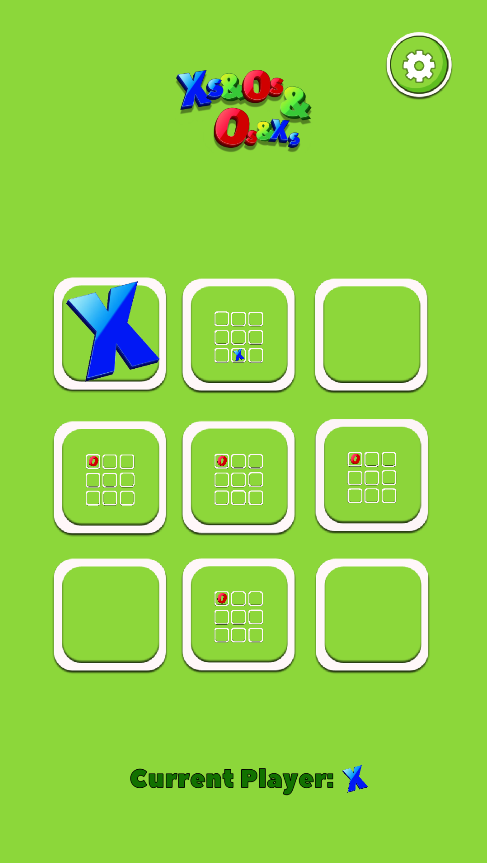

# X's & O's & X's & O's

## Description

"X's & O's & X's & O's" is a "squared up" version of the classic tic-tac-toe game. Challenge a friend or play against the computer, aiming to align three consecutive marks horizontally, vertically, or diagonally.

## Features

- Intuitive and user-friendly interface.
- Two-player mode or play against the computer.
- Game implementation using Unity and C# with a model-view-controller (MVC) architecture for efficient code management.

## Technologies Used

- Unity
- C#

## How to Play - WEBGL

1. Open the game in your browser by [clicking here](https://BonaAndrea.github.io/gamefiles/xsos/xsos.html).
2. Choose your desired game mode: "Play against a friend" or "Play against the computer."
3. Click on an empty square to place your mark (X or O).
4. The goal is to align three consecutive marks horizontally, vertically, or diagonally.

## Android Build

- [Download the Android APK here](https://BonaAndrea.github.io/gamefiles/xsos/Others/XsOsXsOs_1.0.apk) and install it on your Android device to play on the go!

## Contact

- [GitHub Profile](https://github.com/BonaAndrea)
- [Portfolio](https://BonaAndrea.github.io)

## License

This project is licensed under the [MIT License](LICENSE).
